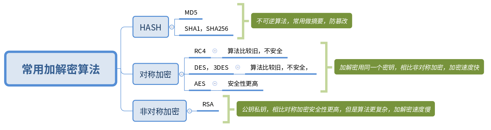
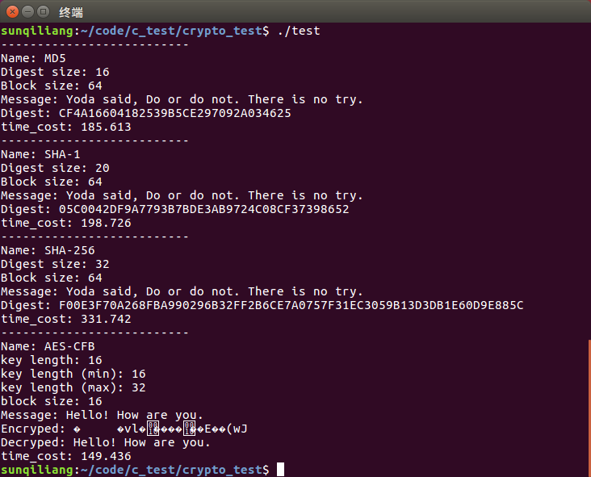

# 常用加密算法使用，交叉编译RSICV平台进行测试



## 源代码
opensource https://github.com/weidai11/cryptopp  
website https://www.cryptopp.com/index.html  
example https://www.cryptopp.com/wiki/Category:Sample

## 修改编译文件
> setenv-embedded.sh 修改 ARM_EMBEDDED_TOOLCHAIN，TOOL_PREFIX， ARM_EMBEDDED_SYSROOT，ARM_EMBEDDED_TOOLCHAIN_VERSION， ARM_EMBEDDED_FLAGS，ARM_EMBEDDED_CXX_HEADERS等参数，修改arm平台为RSICV平台

> GNUmakefile-cross 去掉 --sysroot=$(ARM_EMBEDDED_SYSROOT) 编译选项

## 交叉编译命令
```
$ source ./setenv-embedded.sh
$ make -f GNUmakefile-cross
```

## 编译测试Demo
```
// x86编译
g++ -g3 -ggdb -O0 -Wall -Wextra -Wno-unused -o test test.cpp /usr/local/lib/libcryptopp.a

// 交叉编译
riscv64-unknown-linux-gnu-g++  -g3 -ggdb -O0 -Wall -Wextra -Wno-unused -o test test.cpp -I/usr/local/include/ ./libcryptopp.a 
```

## 运行结果
